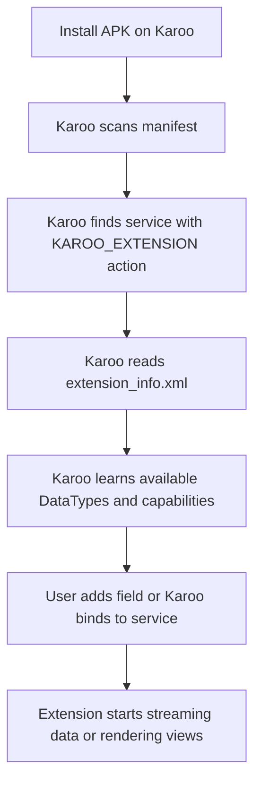

# Karoo Programming Guide for Absolute Beginners

This guide explains how Karoo extension development works from first principles. It assumes you know very little about Android, Kotlin, or the Hammerhead Karoo extension model.

## 1. What a Karoo extension is

A Karoo extension is an Android app that exposes extra capabilities to Karoo OS.

That means:

- your code is packaged as a normal Android APK
- the app runs in its own process
- Karoo OS discovers a specific Android `Service`
- that service tells Karoo what your extension can provide

In practice, a Karoo extension can provide things like:

- custom data fields for ride screens
- device scanning and sensor integration
- custom views for field rendering
- bonus actions or buttons
- route, map, and notification integrations

The important mental model is this:

- the APK is the container
- the extension service is the integration point
- the XML metadata describes the capabilities
- Karoo OS decides how and where to surface them

## 2. What is not an extension

Several things are easy to confuse at the beginning.

### The Karoo App Store list is not the runtime registry

The "Erweiterungen" list on the device behaves like a distribution catalog. An app can be installed by `adb` and still not appear in that list.

During development, this is normal.

### A UI-only Android app is not enough

You can build a Compose screen or an Activity and still have no usable Karoo extension. Karoo looks for a service with the right manifest contract.

### A service alone is not enough

Karoo can bind to your service successfully and your extension can still appear to do nothing. That happens when the extension declares no `DataType`, no device scanning, no bonus action, and no custom view.

## 3. Core building blocks

These are the pieces every beginner should understand.

### 3.1 Android app

You still build a standard Android app module. It has:

- `build.gradle.kts`
- `AndroidManifest.xml`
- Kotlin source files
- Android resources such as strings, layouts, and XML metadata

### 3.2 Karoo extension service

The extension is anchored by a class that extends `KarooExtension`.

Example from this project:

```kotlin
class HelloExtension : KarooExtension("karoo-smart-pitstop", "3")
```

The constructor values mean:

- extension ID: `karoo-smart-pitstop`
- extension version: `3`

The ID must match the metadata you declare elsewhere.

### 3.3 Android manifest registration

Karoo discovers the extension through the Android manifest.

The key parts are:

```xml
<service
    android:name=".extension.HelloExtension"
    android:exported="true">
    <intent-filter>
        <action android:name="io.hammerhead.karooext.KAROO_EXTENSION" />
    </intent-filter>
    <meta-data
        android:name="io.hammerhead.karooext.EXTENSION_INFO"
        android:resource="@xml/extension_info" />
</service>
```

This is the discovery contract.

Without it, Karoo OS will not treat your app as an extension.

### 3.4 Extension metadata XML

The file `extension_info.xml` tells Karoo what your extension offers.

Example:

```xml
<ExtensionInfo
    displayName="@string/extension_name"
    icon="@mipmap/ic_launcher"
    id="karoo-smart-pitstop"
    scansDevices="false">
    <DataType
        typeId="cycling-word"
        displayName="@string/cycling_word_display_name"
        description="@string/cycling_word_description"
        graphical="false"
        icon="@mipmap/ic_launcher" />
</ExtensionInfo>
```

This file is not optional for a usable extension.

## 4. The extension lifecycle

At a high level, the lifecycle looks like this:



Important observation from real testing in this project:

- a sideloaded app installed through `adb` can still be discovered and bound by Karoo OS
- the app does not need to appear in the App Store list to work during development

## 5. Why beginners often think "it is not working"

There are several common traps.

### Trap 1: checking only the App Store style list

That list is about discoverability for end users, not proof that the extension service works.

### Trap 2: expecting a custom field without declaring one

If `extension_info.xml` contains only `ExtensionInfo` and no `DataType`, there is nothing to add to a ride screen.

### Trap 3: sending text into a numeric field

Karoo `DataPoint` values are numeric. A field normally receives `Double` values. If you want to show words, labels, or rich formatting, you generally need a custom view.

### Trap 4: mixing app UI with extension UI

Your Compose Activity is not what Karoo shows inside a ride data field. For in-ride fields, Karoo uses the extension APIs and often `RemoteViews` for rendering.

## 6. Data fields explained simply

Karoo ride screens are built from data fields. A field is a small card-sized region in a ride profile. Standard examples are:

- speed
- heart rate
- elapsed time
- elevation
- distance

An extension can contribute its own field.

That contribution has two parts:

1. declare the field in `extension_info.xml`
2. stream values for that field from code

## 7. Numeric stream versus graphical rendering

This distinction matters a lot.

### Numeric stream

Karoo expects streamed field values as a `DataPoint`, which contains numeric data. In this project the value is carried in:

```kotlin
mapOf(DataType.Field.SINGLE to currentIndex.toDouble())
```

That means the raw field value is `0.0`, `1.0`, `2.0`, and so on.

### Graphical or custom rendering

If you want to show a word like `Grind` instead of a raw number, the extension needs to provide a custom view.

That is why this project uses `RemoteViews` in `startView(...)`.

Karoo can still keep its internal numeric stream while your view displays human-friendly text.

## 8. How the sample in this repo works

The current sample provides a custom field called `Cycling Word`.

### 8.1 Declaration

The field is declared in `extension_info.xml` as `typeId="cycling-word"`.

### 8.2 Data producer

The class `CyclingWordDataType` extends `DataTypeImpl`.

It rotates through a list of words such as:

- Grind
- Surge
- Crest
- Tempo
- Break

### 8.3 Stream behavior

The extension periodically emits a `StreamState.Streaming(DataPoint(...))` object.

Conceptually, it does this:

```kotlin
override fun startStream(emitter: Emitter<StreamState>) {
    emitter.onNext(StreamState.Searching)
    while (true) {
        emitter.onNext(
            StreamState.Streaming(
                DataPoint(
                    dataTypeId = dataTypeId,
                    values = mapOf(DataType.Field.SINGLE to currentIndex.toDouble()),
                )
            )
        )
        delay(5000)
    }
}
```

### 8.4 View behavior

The extension also supplies a `RemoteViews` layout and updates a `TextView` with the current word.

This is what makes the field visually show a word instead of just a number.

## 9. Why the first version showed numbers and text together

This is a good beginner lesson.

Karoo displayed:

- the default numeric field value from the `DataPoint`
- our custom word view on top

Because the custom layout background was transparent at first, both layers were visible. The fix was to give the root layout a solid background so the custom view fully covers Karoo's numeric renderer.

This teaches an important rule:

- when using `RemoteViews`, assume Karoo may still have its own default presentation underneath
- make your custom layout intentionally opaque if you want full control over the visual result

## 10. Where the words actually come from

The rotating words are just a Kotlin list inside the extension code.

Example:

```kotlin
private val CYCLING_WORDS = listOf(
    "Grind", "Surge", "Crest", "Tempo", "Break",
    "Chase", "Climb", "Float", "Draft", "Punch"
)
```

This is a deliberately simple pattern for beginners.

Later, the same mechanism could be driven by:

- a BLE sensor
- route state
- weather data
- cadence zones
- AI-generated pacing hints

## 11. Important files in this repo

Use this as a map.

### Android manifest

`app/src/main/AndroidManifest.xml`

Purpose:

- registers the extension service
- points to `extension_info.xml`
- optionally provides a public manifest URL for distribution

### Extension metadata

`app/src/main/res/xml/extension_info.xml`

Purpose:

- declares extension identity
- lists available field types and other capabilities

### Extension service

`app/src/main/kotlin/io/hammerhead/kaaroosmartpitstop/extension/HelloExtension.kt`

Purpose:

- service entry point for Karoo OS
- exposes the extension's data types

### DataType implementation

`app/src/main/kotlin/io/hammerhead/kaaroosmartpitstop/extension/CyclingWordDataType.kt`

Purpose:

- streams the field's raw data
- renders the field's visible custom text

### RemoteViews layout

`app/src/main/res/layout/datatype_cycling_word.xml`

Purpose:

- defines how the custom field looks inside Karoo

## 12. Development workflow for beginners

Use this loop.

### Step 1: code locally

Make a small change.

### Step 2: build the APK

Example:

```bash
./gradlew app:assembleRelease
```

### Step 3: sign the APK

Example with debug keystore:

```bash
apksigner sign --ks ~/.android/debug.keystore --ks-key-alias androiddebugkey \
  --ks-pass pass:android --key-pass pass:android \
  --out app-release.apk app-release-unsigned.apk
```

### Step 4: install on the device

```bash
adb install -r app/build/outputs/apk/release/app-release.apk
```

### Step 5: inspect logs

```bash
adb logcat -d | grep -i 'kaaroosmartpitstop\|HelloExtension\|karooext'
```

### Step 6: test on the Karoo UI

Typical path:

- open ride profile configuration
- add a data field
- find the extension field
- verify streaming and rendering behavior

## 13. What log messages matter most

When debugging discovery, these are strong signals.

### Good signal

```text
Extensions: connecting to ...HelloExtension
Extensions: ComponentInfo{...HelloExtension} connected
```

This means Karoo found and bound to the service.

### Bad signal

```text
Unable to start service ... not found
```

This usually means:

- the app is not installed
- the manifest entry is wrong
- the service class path changed

## 14. App Store distribution versus development

This is another place where beginners get confused.

### During development

- you can sideload with `adb install`
- the extension can still run normally
- it may not appear in the public App Store style extension list

### For distribution

- you publish an APK URL and manifest URL
- Hammerhead's catalog or community discovery flow must know about it
- only then does it appear in the user-facing catalog list

So development and distribution are separate concerns.

## 15. Beginner debugging checklist

If your extension seems dead, check these in order.

1. Is the APK installed on the Karoo?
2. Does `AndroidManifest.xml` register a `service` with `io.hammerhead.karooext.KAROO_EXTENSION`?
3. Does that service point to `@xml/extension_info`?
4. Does `extension_info.xml` use the same extension ID as your `KarooExtension(...)` constructor?
5. Did you actually declare at least one `DataType` or capability?
6. Do logs show Karoo connecting to the extension?
7. If the field appears but looks wrong, is your `RemoteViews` layout opaque and valid?

## 16. Good beginner design rules

Keep your first extension small and explicit.

- one extension service
- one data type
- one clearly testable behavior
- one easy-to-recognize output on screen

Avoid starting with BLE, networking, sensors, custom permissions, and complex state machines all at once.

## 17. Suggested next learning steps

After a basic custom field works, the next useful steps are:

1. replace the rotating word list with meaningful ride-state logic
2. add a second field type with a different rendering style
3. consume Karoo system events or ride metrics
4. add device scanning if you need external hardware
5. package the app for wider testing and later distribution

## 18. Final mental model

If you remember only one thing, remember this:

Karoo extension programming is not mostly about building a screen.

It is about declaring a capability contract that Karoo OS can discover, bind, query, and render.

For a custom field, the full chain is:

- Android app exists
- extension service is registered
- metadata declares a field
- code streams field values
- optional custom view controls presentation
- Karoo places that field into its ride UI

Once that model is clear, the rest becomes much easier.